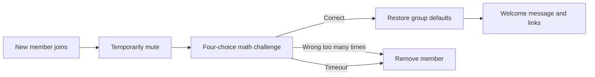

# Telegram Group Verification Bot

[](https://github.com/wxcydzcc/telegram-group-verification-bot/actions/workflows/test.yml)
[](LICENSE)
[](https://workers.cloudflare.com/)

Serverless Telegram group verification for Cloudflare Workers. New members are muted, receive a four-choice math challenge, and are restored to the group's default permissions after a correct answer. Timeouts and repeated wrong answers remove the user; successful verification triggers a configurable welcome message and link menu.

**[中文文档](docs/README.zh-CN.md)**

## Flow



## Features

- Detects new members using `chat_member` updates with a service-message fallback
- Immediately restricts new members
- Random four-choice addition challenge
- Prevents other members from answering someone else's challenge
- Configurable timeout and maximum attempts
- Removes timed-out users with a Cloudflare Cron Trigger
- Restores the group's own default permissions after success
- Configurable welcome text and up to eight optional link buttons
- Deletes join and verification messages when permissions allow
- Administrator-only `/chatid` and `/verify_stats` commands
- Webhook secret validation and Telegram update de-duplication

## Requirements

- A Telegram bot created with [@BotFather](https://t.me/BotFather)
- A Telegram supergroup
- The bot must be a group administrator with:
  - Delete messages
  - Ban/restrict members
- A free Cloudflare account
- A Workers KV namespace
- One Cron Trigger

## Quick deployment from the Cloudflare dashboard

### 1. Create the Worker

Create a Worker named `telegram-group-verification-bot`, replace the example with [`src/index.js`](src/index.js), then deploy.

Verify:

```text
https://YOUR_WORKER.workers.dev/health
```

```json
{"ok":true,"service":"telegram-group-verification-bot"}
```

### 2. Create and bind KV

Create a KV namespace and attach it using the exact binding name:

```text
BOT_DATA
```

### 3. Configure encrypted secrets

| Secret | Description |
|---|---|
| `BOT_TOKEN` | Token created by BotFather |
| `WEBHOOK_SECRET` | Random alphanumeric webhook secret |

### 4. Configure variables

| Variable | Example | Required |
|---|---|---|
| `GROUP_CHAT_ID` | `0` initially, then `-100...` | Yes |
| `GROUP_NAME` | `Example Community` | No |
| `GROUP_URL` | `https://t.me/your_group` | Yes |
| `VERIFY_TIMEOUT_MINUTES` | `5` | No |
| `MAX_VERIFY_ATTEMPTS` | `3` | No |

Optional welcome buttons are added only when their URL is a valid `https://` URL:

| URL variable | Optional label variable |
|---|---|
| `CHANNEL_URL` | `CHANNEL_LABEL` |
| `YOUTUBE_URL` | `YOUTUBE_LABEL` |
| `FORUM_URL` | `FORUM_LABEL` |
| `WEBSITE_URL` | `WEBSITE_LABEL` |
| `X_URL` | `X_LABEL` |
| `BLOG_URL` | `BLOG_LABEL` |
| `NAV_URL` | `NAV_LABEL` |
| `STORE_URL` | `STORE_LABEL` |

Buttons are arranged two per row. Empty URLs are omitted.

### 5. Add the Cron Trigger

In the Worker's trigger settings add:

```text
* * * * *
```

This runs timeout cleanup every minute. Without it, users remain muted until they interact again.

### 6. Set the webhook

On Windows:

```powershell
Set-ExecutionPolicy -Scope Process Bypass
.\tools\setup-webhook.ps1
```

Enter the base Worker URL without `/health` or `/webhook`.

### 7. Discover the group ID

Deploy initially with `GROUP_CHAT_ID=0`, set the webhook, then send this command in the group from an administrator account:

```text
/chatid
```

Update `GROUP_CHAT_ID` with the returned negative number and deploy again.

## Testing checklist

1. Join with a secondary Telegram account.
2. Confirm the account is immediately muted.
3. Confirm a four-choice math challenge appears.
4. Click from another member and confirm it is rejected.
5. Answer correctly and confirm permissions are restored.
6. Confirm the welcome message and configured buttons appear.
7. Rejoin and intentionally fail the challenge.
8. Rejoin and let the challenge expire; allow an extra minute for Cron execution.

## Customization

- Verification prompt: `startVerification` in `src/index.js`
- Welcome copy: `sendWelcome`
- Button order and supported links: `buildLinkKeyboard`
- Default timeout and attempts: constants at the top of `src/index.js`

User-facing strings are currently Chinese-first and can be translated directly in the source.

## Local checks

```bash
npm test
npm run check
```

## Security notes

- Store the Telegram bot token and webhook secret as encrypted Cloudflare secrets.
- Give the bot only the group permissions it needs.
- Do not run multiple verification bots simultaneously; they can race to restrict or remove the same user.
- A Telegram bot has one active webhook. Connecting it to another service replaces this deployment's webhook.

Please report vulnerabilities according to [SECURITY.md](SECURITY.md).

## License

[MIT](LICENSE)
